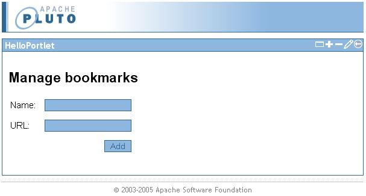
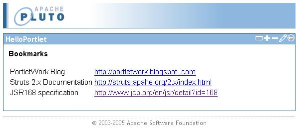
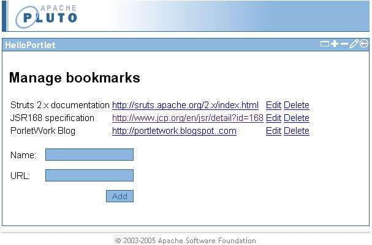

# Struts 2 Portlet Tutorial

## Creating a simple Bookmark Portlet

Using version 2.1.1-SNAPSHOT of the portlet plugin

> Note that this tutorial assumes that you're familiar with basic Struts 2 web application programming.
> If you have not used Struts 2 before, please check out some of the other Struts 2 tutorials first.

### Preparations

In this tutorial we will use eclipse as our IDE. If you do not have Eclipse, you can download it from [http://www.eclipse.org](http://www.eclipse.org). 

The project itself will be set up using Maven 2. Maven 2 is available from [http://maven.apache.org](http://maven.apache.org).

If you have not used the maven-eclipse-plugin before, you need to set up the Eclipse workspace with a variable that points to the Maven 2 repository. To do this, type 


```text
mvn -Declipse.workspace=<path-to-eclipse-workspace> eclipse:add-maven-repo
```

### Creating the project

We'll use Maven 2 with the Struts 2 Portlet Archetype to create a skeleton project for our portlet application. From the command line, issue the command:


```text
mvn archetype:create -DarchetypeGroupId=org.apache.struts -DarchetypeArtifactId=struts2-archetype-portlet -DarchetypeVersion=2.1.1-SNAPSHOT -DartifactId=bookmark-portlet 
    -DgroupId=com.mycompany -DremoteRepositories=http://people.apache.org/repo/m2-snapshot-repository
```

This will set up the maven 2 structure for us and also set up the basic configuration needed to create a Struts 2 portlet. The archetype creates a sample HelloWorld portlet that shows off some of the basic principles of Struts 2 portlet programming. To test the set up, type `mvn jetty:run -P pluto-embedded` in a command prompt. Open a browser and point your browser to http://localhost:8080/bookmark-portlet/pluto/index.jsp and play around.

### Looking at the basics

To see how the basic HelloWorld example works, let's look at some of the configuration files, starting with the JSR168 portlet descriptor

**src/main/webapp/WEB-INF/portlet.xml**


```xml

<?xml version="1.0" encoding="UTF-8"?>

<portlet-app
   version="1.0"
   xmlns="http://java.sun.com/xml/ns/portlet/portlet-app_1_0.xsd"
   xmlns:xsi="http://www.w3.org/2001/XMLSchema-instance"
   xsi:schemaLocation="http://java.sun.com/xml/ns/portlet/portlet-app_1_0.xsd http://java.sun.com/xml/ns/portlet/portlet-app_1_0.xsd"
   id="bookmark-portlet">

   <portlet id="HelloPortlet">
      <description xml:lang="EN">Simple hello world portlet</description>
      <portlet-name>HelloPortlet</portlet-name>
      <display-name xml:lang="EN">bookmark-portlet</display-name>
		
      <portlet-class>org.apache.struts2.portlet.dispatcher.Jsr168Dispatcher</portlet-class>
		
      <!-- The namespace for the actions configured for view mode -->
      <init-param>
         <name>viewNamespace</name>
         <value>/view</value>
      </init-param>
		
      <!-- The default action to invoke in view mode. -->
      <init-param>
         <name>defaultViewAction</name>
         <value>index</value>
      </init-param>
		
      <!-- The namespace for the actions configured for edit mode -->
      <init-param>
         <name>editNamespace</name>
         <value>/edit</value>
      </init-param>
		
      <!-- The default action to invoke in edit mode. -->
      <init-param>
         <name>defaultEditAction</name>
         <value>index!input</value>
      </init-param>
		
      <expiration-cache>0</expiration-cache>
		
      <supports>
         <mime-type>text/html</mime-type>
         <portlet-mode>view</portlet-mode>
         <portlet-mode>edit</portlet-mode>
      </supports>
		
      <supported-locale>en</supported-locale>
		
      <portlet-info>
         <title>HelloPortlet</title>
         <short-title>HelloPortlet</short-title>
         <keywords>struts 2,portlet,hello,world</keywords>
      </portlet-info>
   </portlet>  
</portlet-app>

```

The important parts to notice are the _portlet-class_  and _init-param_  elements. The _portlet-class_  element is always **_org.apache.struts2.portlet.dispatcher.Jsr168Dispatcher_** (or a subclass, if you have added some custom functionality). This is the portlet that acts as the dispatcher for the Struts 2 framework, and translates incoming user interaction to action requests that Struts 2 understands. The init-params _viewNamespace_ , _defaultViewAction_ , _editNamespace_  and _defaultEditAction_  set up some defaults for the dispatcher when the portlet encounters a portlet mode without a specific action. Here, we set up the _view_  portlet mode to map to the _/view_  action namespace, and the _edit_  portlet mode to map to the _/edit_  action namespace. We also specify that the default actions for the mentioned portlet modes are _index_  and _index!input_  respectively. We will recognize these namespaces in the next file:

**src/main/resources/struts.xml**


```xml

<?xml version="1.0" encoding="UTF-8" ?>
<!DOCTYPE struts PUBLIC
    "-//Apache Software Foundation//DTD Struts Configuration 2.0//EN"
    "http://struts.apache.org/dtds/struts-2.0.dtd">

<struts>
   <package name="default" extends="struts-portlet-default" namespace="/view">
        <action name="index" class="com.mycompany.HelloAction">
	    <result>/WEB-INF/jsp/view/index.jsp</result>
	</action>
   </package>
	
   <package name="edit" extends="struts-portlet-default" namespace="/edit">
	<action name="index" class="com.mycompany.UpdateNameAction">
	    <result type="redirectAction">
	        <param name="actionName">index</param>
		<param name="portletMode">view</param>
	    </result>
	    <result name="input">/WEB-INF/jsp/edit/index.jsp</result>
	</action>
    </package>
</struts>

```

As we can see, the actions for the _view_  portlet mode is in the _default_  package, with _/view_  as namespace, and the actions for the _edit_  portlet mode is in the _edit_  package, with _/edit_  as namespace.

### Import the project into Eclipse

Now let's import the project into Eclipse. First, type `mvn eclipse:eclipse -P pluto-embedded` then start Eclipse (if you have not already done so), and import the project using "File -> Import -> General -> Existing Projects into Workspace". Browse to the folder where you created the project and press finish. Your portlet project should now be setup up with all dependencies in place.

### Creating the Bookmark domain object

To represent the bookmarks, we'll create a simple domain object. We'll keep it really simple, so the Bookmark object will only have a _name_  and a _url_  property:

**src/main/java/com/mycompany/domain/Bookmark.java**


```java

public class Bookmark {
   private String name;
   private String url;

   public Bookmark(String name, String url) {
      this.name = name;
      this.url = url;
   }
	
   public String getName() {
      return name;
   }

   public String getUrl() {
      return url;
   }
}

```

### Adding bookmarks

Adding bookmarks is an operation that logically belongs to the _edit_  portlet mode. So we'll create a simple action for this purpose, and configure it in the _edit_  configuration package. In normal Struts 2 fashion, we'll create an action object with the properties we need:

**src/main/java/com/mycompany/AddBookmark.java**


```java

public class AddBookmarkAction extends DefaultActionSupport {

   private String name;
   private String url;

   public void setName(String name) {
      this.name = name;
   }

   public void setUrl(String url) {
      this.url = url;
   }

   @Override
   public String execute() throws Exception {
      return SUCCESS;
   }
}

```

And in struts.xml, remove the existing configuration for the edit package and add an entry for the action:

**struts.xml**


```xml

<package name="edit" extends="struts-portlet-default" namespace="/edit">
	
   <action name="index" class="com.mycompany.AddBookmarkAction">
      <result name="input">/WEB-INF/jsp/edit/index.jsp</result>
   </action>

</package>

```

Let's create the input form so we have something to display. The form is really simple, with a label and a text field for each of the properties in the _Bookmark_  domain object:

**src/main/webapp/WEB-INF/jsp/edit/index.jsp**


```jsp

<%@ taglib prefix="s" uri="/struts-tags" %>

<h2>Manage bookmarks</h2>

<s:form action="index">
   <table>
      <s:textfield name="name" label="Name"/>
      <s:textfield name="url" label="URL"/>
      <s:submit value="Add"/>
   </table>
</s:form>

```

The textfields maps to the property names we have defined in _AddBookmarkAction_ . Before we continue, let's check that everything is configured correctly and check that our portlet can be run. In a command prompt, change into the directory where you have created the project and issue the command `mvn jetty:run -P pluto-embedded` . Then open http://localhost:8080/bookmark-portlet/pluto/index.jsp and click on the _edit_  portlet window control. If everything is set up correctly, you should see a form like this:



If you try to submit data in the form, it will obviously not work since we have not implemented any logic to add bookmarks yet. That will be our next task. Since we'll need a PortletPreferences reference, we'll have the action implement the _PortletPreferencesAware_  interface that will instruct Struts 2 to inject this into our action, without the need for us to look it up manually. When we have the reference to the _PortletPreferences_  object, we'll implement logic to store the bookmark (or rather the bookmark's properties, since we can only store Strings in the preferences object):

**src/main/java/com/mycompany/AddBookmarkAction.java**


```java

public class AddBookmarkAction extends DefaultActionSupport implements PortletPreferencesAware {

   private String name;
   private String url;
	
   private PortletPreferences portletPreferences;

   public void setName(String name) {
      this.name = name;
   }

   public void setUrl(String url) {
      this.url = url;
   }
	
   public void setPortletPreferences(PortletPreferences portletPreferences) {
      this.portletPreferences = portletPreferences;	
   }

   @Override
   public String execute() throws Exception {
      portletPreferences.setValue(name, url);
      portletPreferences.store();
      return SUCCESS;
   }
}

```

After the bookmark has been stored, we'll just redirect back to the input form:

**src/main/resources/struts.xml**


```xml

<package name="edit" extends="struts-portlet-default" namespace="/edit">
	
   <action name="index" class="com.mycompany.AddBookmarkAction">
      <result type="redirectAction">
         <param name="actionName">index!input</param>
      </result>
      <result name="input">/WEB-INF/jsp/edit/index.jsp</result>
   </action>

</package>

```

We use a _redirectAction_  result type to redirect back to the input form in proper PRG (Post - Redirect - Get) manner.

Now we can add some bookmarks. We don't get much feedback though, so let's proceed...

### Listing the bookmarks

The bookmarks will be listed in the _view_  portlet mode, so we'll create a _ListBookmarksAction_  and configure it in the default package:

**src/main/java/com/mycompany/ListBookmarksAction.java**


```java

public class ListBookmarksAction extends DefaultActionSupport implements PortletPreferencesAware {
   private List<Bookmark> bookmarks = new ArrayList<Bookmark>();
   private PortletPreferences portletPreferences;

   public List<Bookmark> getBookmarks() {
      return bookmarks;
   }

   public void setPortletPreferences(PortletPreferences portletPreferences) {
      this.portletPreferences = portletPreferences;
   }

   @Override
   public String execute() throws Exception {
      // For simplicity, we'll assume that only bookmarks are stored in the preferences.
      Map<String, String[]> preferencesMap = portletPreferences.getMap();
      for(Map.Entry<String, String[]> entry : preferencesMap.entrySet()) {
         bookmarks.add(new Bookmark(entry.getKey(), entry.getValue()[0]));
      }
      return SUCCESS;
   }
}

```

Again we use the _PortletPreferencesAware_  to get the _PortletPreferences_  injected in our action. Then we just get all the values from the preferences and add them as a _Bookmark_  instance in an _ArrayList_ .

Obviously, we'll need a jsp to view the list of bookmarks:

**src/main/webapp/WEB-INF/jsp/view/index.jsp**


```jsp

<%@ taglib prefix="s" uri="/struts-tags" %>

<strong>Bookmarks</strong>
<p>
   <table>
   <s:iterator value="%{bookmarks}" var="bookmark">
      <tr>
         <td><s:property value="%{name}"/></td>
         <td><a href="<s:property value="%{url}"/>" target="_blank"><s:property value="%{url}"/></a></td>
      </tr>
   </s:iterator>
   </table>
</p>

```

In the JSP, we just iterate over the list of Bookmarks and print the properties in the iterator loop. 

In struts.xml, remove the _default_  package, and add this instead:

**src/main/resources/struts.xml**


```xml

<package name="view" extends="struts-portlet-default" namespace="/view">
   <action name="index" class="com.mycompany.ListBookmarksAction">
      <result>/WEB-INF/jsp/view/index.jsp</result>
   </action>
</package>

```

When you're ready, go back to a command prompt and start the server again (`mvn jetty:run -P pluto-embedded`), open a browser and start adding some bookmarks. When you go back to _view_  mode after adding a few, you'll see the bookmarks listed:



### Preparing for bookmark management

It would be nice to be able to manage the list of bookmarks, so we'll add delete and edit functionality. All modifications will happen in the _edit_  portlet mode. We'll start by displaying the list of bookmarks in the _edit_  mode as well. The plan is to extend this list to add a _delete_  and an _edit_  link to modify the bookmark entries. We'll do it really simple and just copy the code from the _index.jsp_  for view into the index.jsp for _edit_  and add the links in a new table column:

**src/main/webapp/WEB-INF/jsp/edit/index.jsp**


```jsp

<%@ taglib prefix="s" uri="/struts-tags" %>

<h2>Manage bookmarks</h2>

<p>
   <table>
   <s:iterator value="%{bookmarks}" var="bookmark">
      <s:url action="editBookmark!input" id="editUrl">
         <s:param name="oldName" value="%{name}"/>
      </s:url>
      <s:url action="deleteBookmark" portletUrlType="action" id="deleteUrl">
         <s:param name="bookmarkName" value="%{name}"/>
      </s:url>
      <tr>
         <td><s:property value="%{name}"/></td>
         <td><a href="<s:property value="%{url}"/>" target="_blank"><s:property value="%{url}"/></a></td>
         <td><a href="<s:property value="%{editUrl}"/>">Edit</a></td>
         <td><a href="<s:property value="%{deleteUrl}"/>">Delete</a></td>
      </tr>
   </s:iterator>
   </table>
</p>

<s:form action="addBookmark">
   <table>
      <s:textfield name="name" label="Name"/>
      <s:textfield name="url" label="URL"/>
      <s:submit value="Add"/>
   </table>
</s:form>

```

For the _delete_  url we need to specify that it is a portlet action url since portlet preferences cannot be changed in the render phase. We also need to change our configuration a bit since we'll use this page as index page for _edit_  mode, and not only as the input form for the _AddBookmarkAction_ :

**src/main/resources/struts.xml**


```xml

<package name="edit" extends="struts-portlet-default" namespace="/edit">

   <action name="index" class="com.mycompany.ListBookmarksAction">
      <result>/WEB-INF/jsp/edit/index.jsp</result>
   </action>

   <action name="addBookmark" class="com.mycompany.AddBookmarkAction">
      <result type="redirectAction">
         <param name="actionName">index</param>
      </result>
   </action>

</package>

```

Here we have added the _ListBookmarksAction_  as the _index_  action, which will display the bookmark list with the input form. When the form is submitted, it will invoke the _addBookmark_  action, and upon success, control is redirected back to the _index_  action. With this new structure, we'll also need to updated the portlet descriptor to use _index_  instead of _index!input_  as the default action for _edit_  mode:

**src/main/webapp/WEB-INF/portlet.xml**


```xml

<!-- The default action to invoke in edit mode. -->
<init-param>
   <name>defaultEditAction</name>
   <value>index</value>
</init-param>

```

Now you can (re)start the server and see how it works. This is how it looks in _edit_  mode after adding a few entries:



### Deleting bookmarks

Let's create the action that handles deletion of bookmarks. It's pretty simple. As with our other actions, we need to get a reference to the _PortletPreferences_  and simply remove the bookmark values from it:

**src/main/java/com/mycompany/DeleteBookmarkAction.java**


```java

public class DeleteBookmarkAction extends DefaultActionSupport implements PortletPreferencesAware{

   private String bookmarkName;
	
   private PortletPreferences portletPreferences;

   public void setBookmarkName(String bookmarkName) {
      this.bookmarkName = bookmarkName;
   }
	
   public void setPortletPreferences(PortletPreferences portletPreferences) {
      this.portletPreferences = portletPreferences;
   }
	
   @Override
   public String execute() throws Exception {
      portletPreferences.reset(bookmarkName);
      portletPreferences.store();
      return SUCCESS;
   }

}

```

Pretty simple and straight forward. Next, add a configuration entry for the action in the _edit_  package:

**src/main/resources/struts.xml**


```xml

<action name="deleteBookmark" class="com.mycompany.DeleteBookmarkAction">
   <result type="redirectAction">
      <param name="actionName">index</param>
   </result>
</action>

```

After a bookmark has been deleted, we redirect back to the _index_  action. Now you should be able to click the _Delete_  link to remove individual entries.

### Editing bookmarks

The final step is to edit bookmark entries. When the user clicks the _edit_  link, the portlet will display a new page with an input form and the bookmark values already filled in the text fields. We'll start by creating the jsp file:

**src/main/webapp/WEB-INF/jsp/edit.jsp**


```jsp

<%@ taglib prefix="s" uri="/struts-tags" %>

<h2>Edit bookmark</h2>

<s:form action="editBookmark">
   <input type="hidden" name="oldName" value="<s:property value="%{oldName}"/>"/>
   <table>
      <s:textfield name="name" label="Name" value="%{oldName}"/>
      <s:textfield name="url" label="URL"/>
      <s:submit value="Update"/>
   </table>
</s:form>

```

The _oldName_  hidden field keeps track of which bookmark is beeing edited, since the name is also our id to the entry beeing edited. The actual update of the bookmark will be a "delete and add a new entry":

**src/main/java/com/mycompany/EditBookmarkAction.java**


```java

public class EditBookmarkAction extends DefaultActionSupport implements PortletPreferencesAware, Preparable, ParameterAware {

   private String oldName;
   private String name;
   private String url;
	
   private PortletPreferences portletPreferences;
   private Map<String, String[]> parameters;
	
   public String getOldName() {
      return oldName;
   }
	
   public void setOldName(String oldName) {
      this.oldName = oldName;
   }
	
   public String getUrl() {
      return url;
   }

   public void setUrl(String url) {
      this.url = url;
   }

   public void setName(String name) {
      this.name = name;
   }
	
   public void setPortletPreferences(PortletPreferences portletPreferences) {
      this.portletPreferences = portletPreferences;
   }
	
   public void setParameters(Map<String, String[]> parameters) {
      this.parameters = parameters;
   }
	
   public void prepare() throws Exception {
      // Since the prepare interceptor is run before the parameter interceptor, 
      // we have to get the parameter "manually".
      this.oldName = parameters.get("oldName")[0];
      this.url = portletPreferences.getValue(oldName, null);
   }
	
   public String execute() throws Exception {
      // The modification is handled as remove/add
      portletPreferences.reset(oldName);
      portletPreferences.setValue(name, url);
      portletPreferences.store();
      return SUCCESS;
   }
}

```

There's a couple of new things here, but nothing unfamiliar if you have worked with Struts 2 before. We use the _Preparable_  interface to pre-populate the vaules in the edit form, and we use the _ParameterAware_  interface to get a reference to the request parameter map. Other than that, the _execute_  method simply resets the old value for the bookmark and add it with the (possibly) new name.

The last thing we need to do is to add the configuration in the _edit_  package for the new action:

**src/main/resources/struts.xml**


```xml

<action name="editBookmark" class="com.mycompany.EditBookmarkAction">
   <result type="redirectAction">
      <param name="actionName">index</param>
   </result>
   <result name="input">/WEB-INF/jsp/edit/edit.jsp</result>
</action>

```

### Summary

Using Struts 2, we built a simple bookmark portlet utilizing the _edit_  portlet mode for management operations. The tutorial should have given you a basic understanding of portlet development with Struts 2, and that it is not very different from using Struts 2 in a regular web application. 

### Notes

Instead of using the Maven 2 Jetty plugin to run the tutorial, you can check out the _JettyPlutoLauncher_  which is included in the test sources. Just launch it as a regular Java class in your IDE. And to debug, just launch it in debug mode.

### Links

+ _S2PLUGINS:Source code for the tutorial_ 
+ [JSR168 Specification](http://jcp.org/aboutJava/communityprocess/final/jsr168/index)
+ [Struts 2 Portlet Configuration options](http://struts.apache.org/2.x/docs/portlet-configuration)
+ [Author's blog about portlet related development](http://portletwork.blogspot.com)
+ [Old tutorial for WebWork 2](http://struts.apache.org/2.x/docs/portlet-tutorial-webwork-22)
